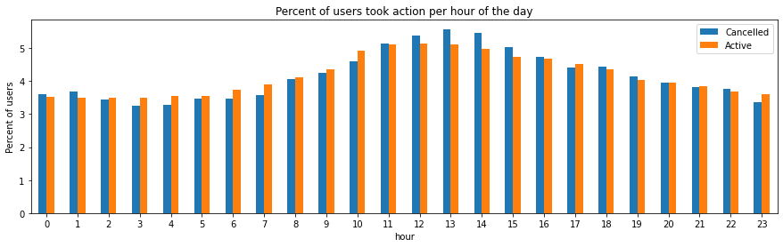
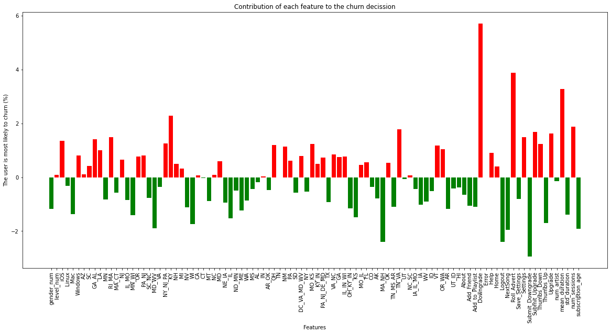

# Will they go?

***Using Data Science (pySpark) to detect customers' churn behavior.***

## Introduction
Many companies have switched their business model from a one-time fee to a monthly or annual subscription. The customers have the right to cancel their subscription at any time, or, in some cases, downgrade to the free subscription model. It is very important for companies to keep their customers at the paid level if they want to maintain or improve their profits.

Customers who leave away from a service usually have some features. These features are indicators that the company will lose this customer soon! So companies should figure out what features might trigger customers' leave, predict the turnover decision, contact customers to offer some discounts or incentives to keep them. 

The loss of customers is called ‘customer churn’ while keeping the customers and avoiding their leave is called ‘customer retention’.

## Use machine learning to detect customer churn
We have an example of a virtual company called ‘Sparkify’ who offers paid and free listening service, the customers can switch between either service, and they can cancel their subscription at any time.

The given customers dataset is medium size having 242MB, thus the standard tools for analysis and machine learning will  be useful here. We perform analys using Big Data tools like Apache Spark which is one of the fastest big data tools.

## Preparing dataset
The given dataset contains 18 fields, the fields include usedId, sessionID, subscription level, the visited page (the action made by the user like downgrade, upgrade, listened to next file, invited a friend, …), a timestamp, user’s gender, location, and name, in addition to some of the file’s info like author, artist, and length.

***Preparing steps***
* Some records contain empty userId or empty sessionID, these are the logged-out users, so we should first drop them all.
* The dataset lacks an indicator of whether the user churns or not, we should add a churn field for that.

***Data exploring***
First, let’s see the number of churn users.

From the figure above, we see a huge number of cancelation, about 25% of the users canceled!

Then, explore the churn users by gender or by subscription.

We see that more male users cancelled than females. Gender may affect churn.

Free users cancelled the service slightly more than paid users. Level may impact less than gender on churn.

Next, let’s see when the churn users are most active.

The churn users are most active at the beginning of the month. Thus, most cancellation happens at the end of the month, which is logical to avoid renewal fees.

Another question: does the users’ operating system affect their activity?

It seems that Mac users are more willing to be active than Windows users, but the impact is not significant visually.

Then, does state of an user affect their decisions?

Obviously, user in some of the states are more likely to churn than others.

There are many other features we explored, which is detailed in the GitHub page below.

After exploring the dataset and knowing the features to include, or those who need to be extracted from the existing data, we ended in the following set of possibly influencing features.
Categoric features (features with discrete specific values). This includes gender, subscription level, the operating system, and state. Numeric features (continuous values) include session’s duration, sessions’ count, the total subscription days, the frequency of actions like thumbs-up, thumbs-down, friend invitations, listened-to files per session. Machine learning algorithms only deal with numeric values, hence, we should convert categoric features to numbers, for example, to give one gender a 1., and the other 0. If the feature contains unordered values, then we should encode them by the one-hot-encoding method, which involves creating a separate column to each value, with 1 or 0 to indicate if it applies or not.

By finishing this operation, we have a new dataset for analysis, which is in the form of userID >> feature01, feature02, …

## Modeling
We have tested 5 machine learning models for classification to see which has the best performance. The used models are the Logistic Regression model, Decision Tree Classifier model, Gradient-Boosted Trees (GBTs) model, Random Forest model, Multilayer Perceptron Classifier model. As a final adjustment for the data, we have normalized all the input features and combined them into one vector. Then we divided the dataset into 90% for training the model, and 10% for testing.

***The logistic regression model***

As we see in the table above, the accuracy of the logistic regression model is relatively good, 85.8% and 84.2% for the training and the testing datasets. Other measures like precision, recall, and F-score are close to the accuracy values. This shows good performance of the model to detect churn customers. The attached chart shows the weight of each feature; for example, the downgrade, roll_advert, and mean session duration are the three features most likely to make customers leave. Interesting, submit_downgrade does not necessarily mean the leave of a customer. 

***The decision tree model***

As we can see, decision tree performs much better than logistic regression by having the accuracy of 98.6% and 94.3% for training and testing. Other metrics such as precision, recall and F-measure are also better than logistic regression. The bar chart demonstrates that subscription age is the most significant indicator of customer churn followed by downgrade and logout, which is differen from what we get by logistic regression. 

***The Gradient-Boosted Trees (GBTs) model***

This model, has higher accuracy for traning but lower for testing compared to decision tree, but the testing performance is still good in terms of accuracy. However, for F-measure, precision, recall, the testing performance is much lower than training, generating some overfitting problem. 

***The Random Forest model***

Random forest, although performing well in accuracy, also has some overfitting issue in terms of recall and F-measure. Like the other classifiers, subscription age and downgrade are the two most significant factors that make customers churn. 

***The Multilayer Perceptron Layer (MPL) Classifier***

Again, MPL also has overfitting problem by having much lower testing performance. It should be noted that 'MultilayerPerceptronClassificationModel' object has no attribute 'featureImportances', so we cannot investigate the feature importance for this model. 

## Conclusion
The above machine learning models can successfully predict customers' churn behavior that will most probably end in unsubscribing. Despite the good results of all the models, the Decision Tree Classifier appears to be the best followed by logistic regression. The other three models all have overfitting issue.

